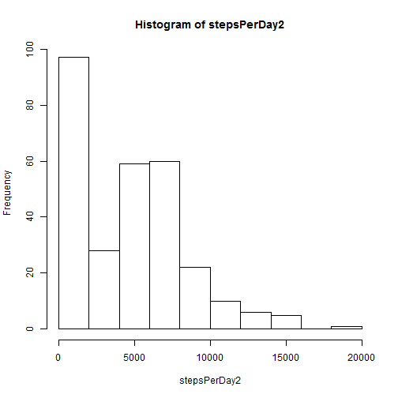
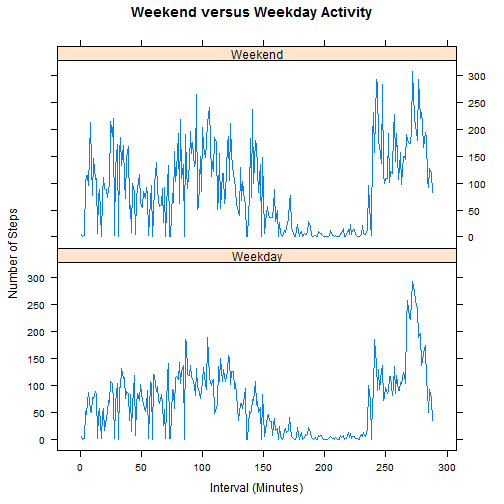

## Loading and preprocessing the data


```r
## File is downloaded and unziped in working directory
if (! file.exists("activity.zip")){
        url = 'https://d396qusza40orc.cloudfront.net/repdata%2Fdata%2Factivity.zip'
        download.file(url,"./activity.zip")
        }

if (! file.exists("activity.csv")){
        unzip("activity.zip")
        }
## Read Actvity data
actData = read.csv("activity.csv", header= TRUE)
```

## What is mean total number of steps taken per day?

```r
##1. Calculate the total number of steps taken per day
stepsPerDay = tapply(actData$steps, actData$date, sum)
##2. Make a histogram of the total number of steps taken each day
hist(stepsPerDay)
```

 

```r
##3. Calculate and report the mean and median of the total number of steps taken per day
meanStepsPerDay = tapply(actData$steps, actData$date, mean)
medianStepsPerDay = tapply(actData$steps, actData$date ,median)
## create two vectors that has mean and medians for steps by date
```


## What is the average daily activity pattern?

```r
## 1. Make a time series plot (i.e. type = "l") of the 5-minute interval (x-axis) and the average number of steps taken, averaged across all days (y-axis)
## To avoid NA causing a very high number values for '0' interval, remove the NAs before ploting the data.
actNoNA = actData[!is.na(actData$steps) ,]
meanStepsPerInterval = tapply(actNoNA$steps, actNoNA$interval, mean )
plot(meanStepsPerInterval ,type="l")
```

 

```r
## 2. Which 5-minute interval, on average across all the days in the dataset, contains the maximum number of steps?
maxNumberInterval = actNoNA[which.max(meanStepsPerInterval), "interval"]
```
The **interval with maximum number of steps** (after removing NAs) is **835** .

## Imputing missing values


```r
## There are a number of days/intervals where there are missing values (coded as NA). The NAs are substitute.
##1. Calculate and report the total number of missing values in the dataset (i.e. the total number of rows with NAs)
totalCount = nrow(actData)        
missingValueCount= sum(is.na(actData$steps))
```

### The total rows in original data set are 17568 and missing value row count is 2304

```r
        ## 2. Strategy for filling in all of the missing values in the dataset is
        ##   Calculate the mean, min and max by interval after removing the NAs. 
        ##   Create new value based on random number generator 
        ##      to avoid negative value, absolute of rnorm is taken.
        ##   Scale the value by multiplying with (max -min) and then rounding to integer.
        
        ## 3. Create a new dataset that is equal to the original dataset but with the missing data filled in.
        
        summaryStepsPerInterval = tapply(actNoNA$steps, actNoNA$interval, summary)
        sdStepsPerInterval = tapply(actNoNA$steps, actNoNA$interval, sd)
        ##  replaceNA
        actUpdated =actData
        ##        actNoNA = actData[!is.na(activity$steps) ,] done earlier
        summaryStepsPerInterval = tapply(actNoNA$steps, actNoNA$interval, summary)
        set.seed(100)                
        for (i in 1 : nrow(actUpdated))
                {
                if (is.na(actUpdated[i,"steps"]))
                        {       stepName = as.character(actUpdated[i,"interval"])
                                mean1 =summaryStepsPerInterval[[stepName]]["Mean"]
                                min1 =summaryStepsPerInterval[[stepName]]["Min."]
                                max1 =summaryStepsPerInterval[[stepName]]["Max."]
                                stepValue = round(abs (rnorm(1)) * (max1-min1),0)
                                actUpdated[i,"steps"] = stepValue
                                }
                }
        ##  actUpdated is new data set with missing values filled. Sample values after update are
        head(actUpdated)
```

```
##   steps       date interval
## 1    24 2012-10-01        0
## 2     2 2012-10-01        5
## 3     1 2012-10-01       10
## 4     7 2012-10-01       15
## 5     0 2012-10-01       20
## 6    17 2012-10-01       25
```

```r
        ## See data
        
        ## 4. Histogram of the total number of steps taken each day and Calculate and report the mean and median total number of steps taken per day. 
        
        ## Historgram
        
        stepsPerDay2 = tapply(actUpdated$steps, actUpdated$interval, sum)
        hist(stepsPerDay2)
```

 

```r
        ### Do these values differ from the estimates from the first part of the assignment? What is the impact of imputing missing data on the estimates of the total daily number of steps?
```


## Are there differences in activity patterns between weekdays and weekends?


```r
#1. Create a new factor variable in the dataset with two levels - "weekday" and "weekend" indicating whether a given date is a weekday or weekend day.

        actUpdated2 <- cbind(actUpdated ,weekdays(as.POSIXct(actUpdated$date , format='%Y-%m-%d')))
        colnames(actUpdated2)[4] = "weekday"
        orderedWeekdays = c("Sunday", "Monday","Tuesday","Wednesday", "Thursday","Friday", "Saturday")
        actUpdated2$weekday = factor(actUpdated2$weekday , levels = orderedWeekdays)
## Map weekend adn weekdays
        levels(actUpdated2$weekday) = c("weekend", "weekend", "weekday" , "weekday", "weekday", "weekday", "weekday")
        
        actWeekend = actUpdated2[actUpdated2$weekday =="weekend",]
        actWeekday = actUpdated2[actUpdated2$weekday =="weekday",]
        meanStepsPerInterval_weekday = tapply(actWeekday$steps, actWeekday$interval ,mean)
        meanStepsPerInterval_weekend = tapply(actWeekend$steps, actWeekend$interval ,mean)
        
## Will use lattice to plot        
        library(lattice)

## Create dataframe containing means in tidy format.
        plotdata1 <-data.frame( rownames(meanStepsPerInterval_weekday),meanStepsPerInterval_weekday,'Weekday')
        colnames(plotdata1)[1] = "Interval"
        colnames(plotdata1)[2] = "Average"
        colnames(plotdata1)[3] = "Weekendorday"
        row.names(plotdata1) =seq(from =1, to= nrow(plotdata1) )
        
        plotdata2 <-data.frame( rownames(meanStepsPerInterval_weekend),meanStepsPerInterval_weekend,'Weekend')
        colnames(plotdata2)[1] = "Interval"
        colnames(plotdata2)[2] = "Average"
        colnames(plotdata2)[3] = "Weekendorday"
        row.names(plotdata2) =seq(from =1, to= nrow(plotdata2) )
        plotdata <- rbind(plotdata1 , plotdata2)
        
         my.plot = xyplot(Average ~ as.numeric(Interval) | Weekendorday ,
               data = plotdata,
               type='a',
               main='Weekend versus Weekday Activity',
               xlab ='Interval (Minutes)',
               ylab =' Number of Steps',
              layout = c(1,2))

        print(my.plot)
```

 
### During Weekend, there is more activity from 10:00 hrs to 13:00 hrs

